# Kroki fenced diagram examples

This document contains one fenced code block for every diagram type exposed by
the current Kroki server registry. A normal Markdown renderer may show some of
these blocks as source code; a Kroki-aware toolchain can render them by using
the fence language as `diagram_type`.

## PlantUML

<!-- code-to-uml:generated:start -->
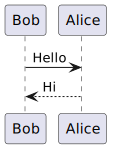

<details>
<summary>View plantuml source</summary>

<!-- code-to-uml:source:start -->
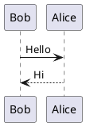
<!-- code-to-uml:source:end -->

</details>
<!-- code-to-uml:generated:end -->

## C4 PlantUML

<!-- code-to-uml:generated:start -->
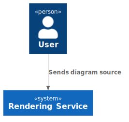

<details>
<summary>View c4plantuml source</summary>

<!-- code-to-uml:source:start -->
```c4plantuml
@startuml
!include <C4/C4_Context>
Person(user, "User")
System(system, "Rendering Service")
Rel(user, system, "Sends diagram source")
@enduml
```
<!-- code-to-uml:source:end -->

</details>
<!-- code-to-uml:generated:end -->

## Ditaa

<!-- code-to-uml:generated:start -->
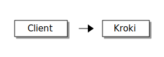

<details>
<summary>View ditaa source</summary>

<!-- code-to-uml:source:start -->
```ditaa
+--------+     +-------+
| Client | --> | Kroki |
+--------+     +-------+
```
<!-- code-to-uml:source:end -->

</details>
<!-- code-to-uml:generated:end -->

## BlockDiag

<!-- code-to-uml:generated:start -->
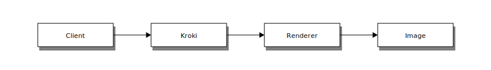

<details>
<summary>View blockdiag source</summary>

<!-- code-to-uml:source:start -->
```blockdiag
blockdiag {
  Client -> Kroki -> Renderer -> Image;
}
```
<!-- code-to-uml:source:end -->

</details>
<!-- code-to-uml:generated:end -->

## SeqDiag

<!-- code-to-uml:generated:start -->
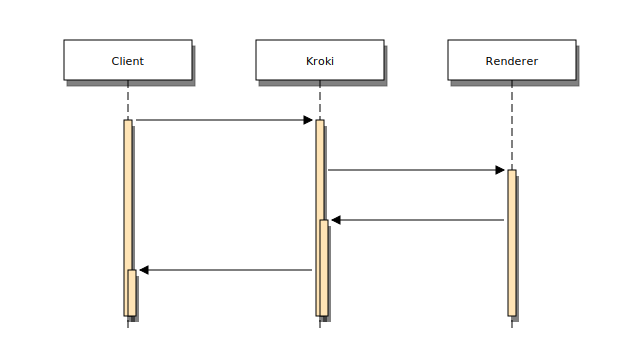

<details>
<summary>View seqdiag source</summary>

<!-- code-to-uml:source:start -->
```seqdiag
seqdiag {
  Client -> Kroki;
  Kroki -> Renderer;
  Renderer -> Kroki;
  Kroki -> Client;
}
```
<!-- code-to-uml:source:end -->

</details>
<!-- code-to-uml:generated:end -->

## ActDiag

<!-- code-to-uml:generated:start -->
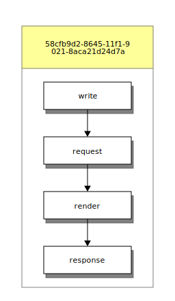

<details>
<summary>View actdiag source</summary>

<!-- code-to-uml:source:start -->
```actdiag
actdiag {
  write -> request -> render -> response;
}
```
<!-- code-to-uml:source:end -->

</details>
<!-- code-to-uml:generated:end -->

## NwDiag

<!-- code-to-uml:generated:start -->
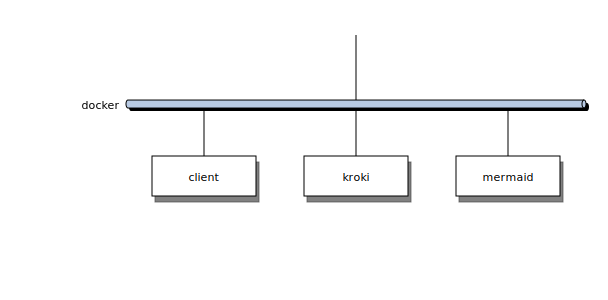

<details>
<summary>View nwdiag source</summary>

<!-- code-to-uml:source:start -->
```nwdiag
nwdiag {
  network docker {
    client;
    kroki;
    mermaid;
  }
}
```
<!-- code-to-uml:source:end -->

</details>
<!-- code-to-uml:generated:end -->

## PacketDiag

<!-- code-to-uml:generated:start -->
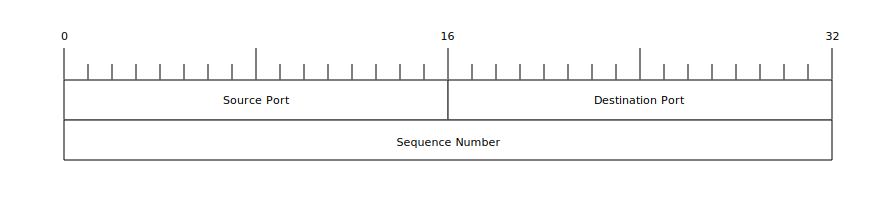

<details>
<summary>View packetdiag source</summary>

<!-- code-to-uml:source:start -->
```packetdiag
packetdiag {
  colwidth = 32;
  0-15: "Source Port";
  16-31: "Destination Port";
  32-63: "Sequence Number";
}
```
<!-- code-to-uml:source:end -->

</details>
<!-- code-to-uml:generated:end -->

## RackDiag

<!-- code-to-uml:generated:start -->
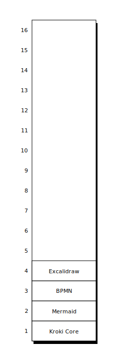

<details>
<summary>View rackdiag source</summary>

<!-- code-to-uml:source:start -->
```rackdiag
rackdiag {
  16U;
  1: Kroki Core;
  2: Mermaid;
  3: BPMN;
  4: Excalidraw;
}
```
<!-- code-to-uml:source:end -->

</details>
<!-- code-to-uml:generated:end -->

## UMLet

<!-- code-to-uml:generated:start -->


<details>
<summary>View umlet source</summary>

<!-- code-to-uml:source:start -->
```umlet
<?xml version="1.0" encoding="UTF-8"?>
<diagram program="umlet" version="15.1">
  <zoom_level>10</zoom_level>
  <element>
    <id>UMLClass</id>
    <coordinates><x>20</x><y>20</y><w>180</w><h>80</h></coordinates>
    <panel_attributes>Kroki
--
+ render()</panel_attributes>
    <additional_attributes></additional_attributes>
  </element>
</diagram>
```
<!-- code-to-uml:source:end -->

</details>
<!-- code-to-uml:generated:end -->

## Graphviz

<!-- code-to-uml:generated:start -->
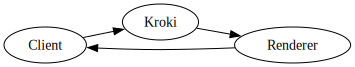

<details>
<summary>View graphviz source</summary>

<!-- code-to-uml:source:start -->
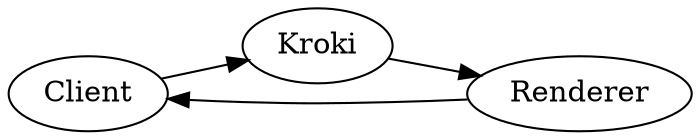
<!-- code-to-uml:source:end -->

</details>
<!-- code-to-uml:generated:end -->

## DOT alias

<!-- code-to-uml:generated:start -->
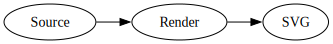

<details>
<summary>View graphviz source</summary>

<!-- code-to-uml:source:start -->
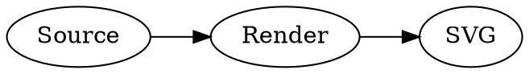
<!-- code-to-uml:source:end -->

</details>
<!-- code-to-uml:generated:end -->

## ERD

<!-- code-to-uml:generated:start -->
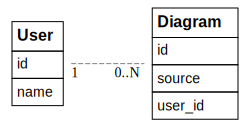

<details>
<summary>View erd source</summary>

<!-- code-to-uml:source:start -->
```erd
[User]
*id
name

[Diagram]
*id
source
user_id

User 1--* Diagram
```
<!-- code-to-uml:source:end -->

</details>
<!-- code-to-uml:generated:end -->

## SvgBob

<!-- code-to-uml:generated:start -->
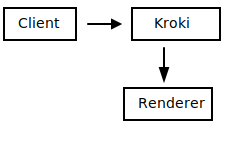

<details>
<summary>View svgbob source</summary>

<!-- code-to-uml:source:start -->
```svgbob
+--------+      +----------+
| Client | ---> |  Kroki   |
+--------+      +----------+
                    |
                    v
               +----------+
               | Renderer |
               +----------+
```
<!-- code-to-uml:source:end -->

</details>
<!-- code-to-uml:generated:end -->

## Symbolator

<!-- code-to-uml:generated:start -->
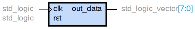

<details>
<summary>View symbolator source</summary>

<!-- code-to-uml:source:start -->
```symbolator
component demo is
  port (
    clk : in std_logic;
    rst : in std_logic;
    out_data : out std_logic_vector(7 downto 0)
  );
end component;
```
<!-- code-to-uml:source:end -->

</details>
<!-- code-to-uml:generated:end -->

## Nomnoml

<!-- code-to-uml:generated:start -->
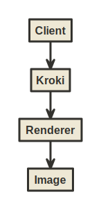

<details>
<summary>View nomnoml source</summary>

<!-- code-to-uml:source:start -->
```nomnoml
[Client] -> [Kroki]
[Kroki] -> [Renderer]
[Renderer] -> [Image]
```
<!-- code-to-uml:source:end -->

</details>
<!-- code-to-uml:generated:end -->

## Mermaid

<!-- code-to-uml:generated:start -->
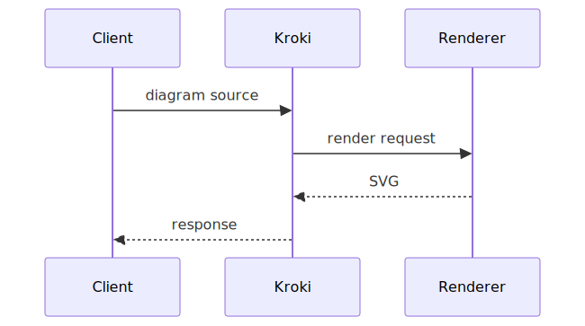

<details>
<summary>View mermaid source</summary>

<!-- code-to-uml:source:start -->
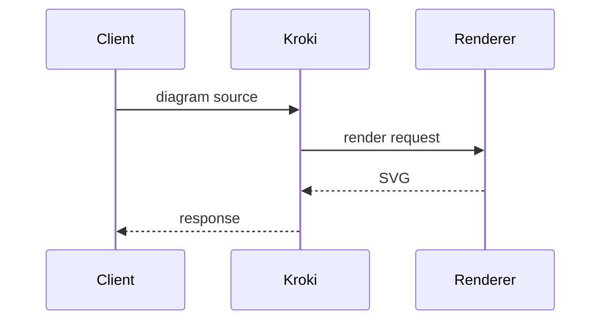
<!-- code-to-uml:source:end -->

</details>
<!-- code-to-uml:generated:end -->

## Vega

<!-- code-to-uml:generated:start -->
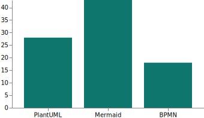

<details>
<summary>View vega source</summary>

<!-- code-to-uml:source:start -->
```vega
{
  "$schema": "https://vega.github.io/schema/vega/v5.json",
  "width": 320,
  "height": 180,
  "data": [
    {
      "name": "table",
      "values": [
        { "category": "PlantUML", "amount": 28 },
        { "category": "Mermaid", "amount": 43 },
        { "category": "BPMN", "amount": 18 }
      ]
    }
  ],
  "scales": [
    { "name": "x", "type": "band", "domain": { "data": "table", "field": "category" }, "range": "width", "padding": 0.2 },
    { "name": "y", "domain": { "data": "table", "field": "amount" }, "range": "height" }
  ],
  "axes": [
    { "orient": "bottom", "scale": "x" },
    { "orient": "left", "scale": "y" }
  ],
  "marks": [
    {
      "type": "rect",
      "from": { "data": "table" },
      "encode": {
        "enter": {
          "x": { "scale": "x", "field": "category" },
          "width": { "scale": "x", "band": 1 },
          "y": { "scale": "y", "field": "amount" },
          "y2": { "scale": "y", "value": 0 },
          "fill": { "value": "#0f766e" }
        }
      }
    }
  ]
}
```
<!-- code-to-uml:source:end -->

</details>
<!-- code-to-uml:generated:end -->

## Vega-Lite

<!-- code-to-uml:generated:start -->
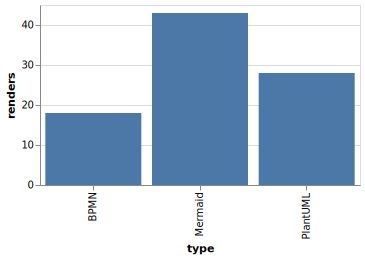

<details>
<summary>View vegalite source</summary>

<!-- code-to-uml:source:start -->
```vegalite
{
  "$schema": "https://vega.github.io/schema/vega-lite/v5.json",
  "width": 320,
  "height": 180,
  "data": {
    "values": [
      { "type": "PlantUML", "renders": 28 },
      { "type": "Mermaid", "renders": 43 },
      { "type": "BPMN", "renders": 18 }
    ]
  },
  "mark": "bar",
  "encoding": {
    "x": { "field": "type", "type": "nominal" },
    "y": { "field": "renders", "type": "quantitative" }
  }
}
```
<!-- code-to-uml:source:end -->

</details>
<!-- code-to-uml:generated:end -->

## WaveDrom

<!-- code-to-uml:generated:start -->
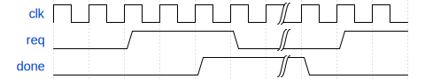

<details>
<summary>View wavedrom source</summary>

<!-- code-to-uml:source:start -->
```wavedrom
{ signal: [
  { name: "clk",  wave: "p.....|..." },
  { name: "req",  wave: "0.1..0|.1." },
  { name: "done", wave: "0...1.|0.." }
]}
```
<!-- code-to-uml:source:end -->

</details>
<!-- code-to-uml:generated:end -->

## BPMN

<!-- code-to-uml:generated:start -->
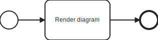

<details>
<summary>View bpmn source</summary>

<!-- code-to-uml:source:start -->
```bpmn
<?xml version="1.0" encoding="UTF-8"?>
<bpmn:definitions
  xmlns:bpmn="http://www.omg.org/spec/BPMN/20100524/MODEL"
  xmlns:bpmndi="http://www.omg.org/spec/BPMN/20100524/DI"
  xmlns:dc="http://www.omg.org/spec/DD/20100524/DC"
  xmlns:di="http://www.omg.org/spec/DD/20100524/DI"
  id="Definitions_1"
  targetNamespace="http://bpmn.io/schema/bpmn">
  <bpmn:process id="Process_1" isExecutable="false">
    <bpmn:startEvent id="StartEvent_1">
      <bpmn:outgoing>Flow_1</bpmn:outgoing>
    </bpmn:startEvent>
    <bpmn:task id="Task_1" name="Render diagram">
      <bpmn:incoming>Flow_1</bpmn:incoming>
      <bpmn:outgoing>Flow_2</bpmn:outgoing>
    </bpmn:task>
    <bpmn:endEvent id="EndEvent_1">
      <bpmn:incoming>Flow_2</bpmn:incoming>
    </bpmn:endEvent>
    <bpmn:sequenceFlow id="Flow_1" sourceRef="StartEvent_1" targetRef="Task_1" />
    <bpmn:sequenceFlow id="Flow_2" sourceRef="Task_1" targetRef="EndEvent_1" />
  </bpmn:process>
  <bpmndi:BPMNDiagram id="BPMNDiagram_1">
    <bpmndi:BPMNPlane id="BPMNPlane_1" bpmnElement="Process_1">
      <bpmndi:BPMNShape id="StartEvent_1_di" bpmnElement="StartEvent_1">
        <dc:Bounds x="120" y="142" width="36" height="36" />
      </bpmndi:BPMNShape>
      <bpmndi:BPMNShape id="Task_1_di" bpmnElement="Task_1">
        <dc:Bounds x="210" y="120" width="130" height="80" />
      </bpmndi:BPMNShape>
      <bpmndi:BPMNShape id="EndEvent_1_di" bpmnElement="EndEvent_1">
        <dc:Bounds x="400" y="142" width="36" height="36" />
      </bpmndi:BPMNShape>
      <bpmndi:BPMNEdge id="Flow_1_di" bpmnElement="Flow_1">
        <di:waypoint x="156" y="160" />
        <di:waypoint x="210" y="160" />
      </bpmndi:BPMNEdge>
      <bpmndi:BPMNEdge id="Flow_2_di" bpmnElement="Flow_2">
        <di:waypoint x="340" y="160" />
        <di:waypoint x="400" y="160" />
      </bpmndi:BPMNEdge>
    </bpmndi:BPMNPlane>
  </bpmndi:BPMNDiagram>
</bpmn:definitions>
```
<!-- code-to-uml:source:end -->

</details>
<!-- code-to-uml:generated:end -->

## Bytefield

<!-- code-to-uml:generated:start -->


<details>
<summary>View bytefield source</summary>

<!-- code-to-uml:source:start -->
```bytefield
(def boxes-per-row 16)
(draw-column-headers)
(draw-box "Version" {:span 4})
(draw-box "Type" {:span 4})
(draw-box "Length" {:span 8})
(draw-box "Payload" {:span 16})
```
<!-- code-to-uml:source:end -->

</details>
<!-- code-to-uml:generated:end -->

## Excalidraw

<!-- code-to-uml:generated:start -->
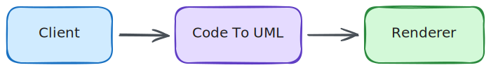

<details>
<summary>View excalidraw source</summary>

<!-- code-to-uml:source:start -->
```excalidraw
{
  "type": "excalidraw",
  "version": 2,
  "source": "kroki-example",
  "elements": [
    {
      "id": "client-box",
      "type": "rectangle",
      "x": 40,
      "y": 80,
      "width": 150,
      "height": 80,
      "angle": 0,
      "strokeColor": "#1971c2",
      "backgroundColor": "#d0ebff",
      "fillStyle": "solid",
      "strokeWidth": 2,
      "strokeStyle": "solid",
      "roughness": 1,
      "opacity": 100,
      "groupIds": [],
      "frameId": null,
      "roundness": { "type": 3 },
      "seed": 101,
      "version": 1,
      "versionNonce": 101,
      "isDeleted": false,
      "boundElements": [],
      "updated": 1,
      "link": null,
      "locked": false
    },
    {
      "id": "gateway-box", "type": "rectangle", "x": 280, "y": 80, "width": 180, "height": 80,
      "angle": 0, "strokeColor": "#5f3dc4", "backgroundColor": "#e5dbff", "fillStyle": "solid",
      "strokeWidth": 2, "strokeStyle": "solid", "roughness": 1, "opacity": 100, "groupIds": [], "frameId": null,
      "roundness": { "type": 3 }, "seed": 102, "version": 1, "versionNonce": 102, "isDeleted": false,
      "boundElements": [], "updated": 1, "link": null, "locked": false
    },
    {
      "id": "renderer-box", "type": "rectangle", "x": 550, "y": 80, "width": 170, "height": 80,
      "angle": 0, "strokeColor": "#2b8a3e", "backgroundColor": "#d3f9d8", "fillStyle": "solid",
      "strokeWidth": 2, "strokeStyle": "solid", "roughness": 1, "opacity": 100, "groupIds": [], "frameId": null,
      "roundness": { "type": 3 }, "seed": 103, "version": 1, "versionNonce": 103, "isDeleted": false,
      "boundElements": [], "updated": 1, "link": null, "locked": false
    },
    {
      "id": "client-label", "type": "text", "x": 82, "y": 106, "width": 66, "height": 25, "angle": 0,
      "strokeColor": "#1e1e1e", "backgroundColor": "transparent", "fillStyle": "solid", "strokeWidth": 1,
      "strokeStyle": "solid", "roughness": 1, "opacity": 100, "groupIds": [], "frameId": null, "roundness": null,
      "seed": 201, "version": 1, "versionNonce": 201, "isDeleted": false, "boundElements": null, "updated": 1,
      "link": null, "locked": false, "fontSize": 20, "fontFamily": 1, "text": "Client", "textAlign": "center",
      "verticalAlign": "middle", "containerId": null, "originalText": "Client", "autoResize": true, "lineHeight": 1.25
    },
    {
      "id": "gateway-label", "type": "text", "x": 309, "y": 106, "width": 122, "height": 25, "angle": 0,
      "strokeColor": "#1e1e1e", "backgroundColor": "transparent", "fillStyle": "solid", "strokeWidth": 1,
      "strokeStyle": "solid", "roughness": 1, "opacity": 100, "groupIds": [], "frameId": null, "roundness": null,
      "seed": 202, "version": 1, "versionNonce": 202, "isDeleted": false, "boundElements": null, "updated": 1,
      "link": null, "locked": false, "fontSize": 20, "fontFamily": 1, "text": "Code To UML", "textAlign": "center",
      "verticalAlign": "middle", "containerId": null, "originalText": "Code To UML", "autoResize": true, "lineHeight": 1.25
    },
    {
      "id": "renderer-label", "type": "text", "x": 590, "y": 106, "width": 90, "height": 25, "angle": 0,
      "strokeColor": "#1e1e1e", "backgroundColor": "transparent", "fillStyle": "solid", "strokeWidth": 1,
      "strokeStyle": "solid", "roughness": 1, "opacity": 100, "groupIds": [], "frameId": null, "roundness": null,
      "seed": 203, "version": 1, "versionNonce": 203, "isDeleted": false, "boundElements": null, "updated": 1,
      "link": null, "locked": false, "fontSize": 20, "fontFamily": 1, "text": "Renderer", "textAlign": "center",
      "verticalAlign": "middle", "containerId": null, "originalText": "Renderer", "autoResize": true, "lineHeight": 1.25
    },
    {
      "id": "arrow-1", "type": "arrow", "x": 200, "y": 120, "width": 70, "height": 0, "angle": 0,
      "strokeColor": "#495057", "backgroundColor": "transparent", "fillStyle": "solid", "strokeWidth": 2,
      "strokeStyle": "solid", "roughness": 1, "opacity": 100, "groupIds": [], "frameId": null, "roundness": { "type": 2 },
      "seed": 301, "version": 1, "versionNonce": 301, "isDeleted": false, "boundElements": null, "updated": 1,
      "link": null, "locked": false, "points": [[0,0],[70,0]], "lastCommittedPoint": null,
      "startBinding": null, "endBinding": null, "startArrowhead": null, "endArrowhead": "arrow"
    },
    {
      "id": "arrow-2", "type": "arrow", "x": 470, "y": 120, "width": 70, "height": 0, "angle": 0,
      "strokeColor": "#495057", "backgroundColor": "transparent", "fillStyle": "solid", "strokeWidth": 2,
      "strokeStyle": "solid", "roughness": 1, "opacity": 100, "groupIds": [], "frameId": null, "roundness": { "type": 2 },
      "seed": 302, "version": 1, "versionNonce": 302, "isDeleted": false, "boundElements": null, "updated": 1,
      "link": null, "locked": false, "points": [[0,0],[70,0]], "lastCommittedPoint": null,
      "startBinding": null, "endBinding": null, "startArrowhead": null, "endArrowhead": "arrow"
    }
  ],
  "appState": { "viewBackgroundColor": "#ffffff" },
  "files": {}
}
```
<!-- code-to-uml:source:end -->

</details>
<!-- code-to-uml:generated:end -->

## Pikchr

<!-- code-to-uml:generated:start -->


<details>
<summary>View pikchr source</summary>

<!-- code-to-uml:source:start -->
```pikchr
box "Client"; arrow; box "Kroki"; arrow; box "Renderer"
```
<!-- code-to-uml:source:end -->

</details>
<!-- code-to-uml:generated:end -->

## Structurizr

<!-- code-to-uml:generated:start -->
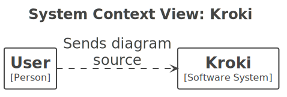

<details>
<summary>View structurizr source</summary>

<!-- code-to-uml:source:start -->
```structurizr
workspace {
  model {
    user = person "User"
    system = softwareSystem "Kroki"
    user -> system "Sends diagram source"
  }
  views {
    systemContext system {
      include *
      autolayout lr
    }
  }
}
```
<!-- code-to-uml:source:end -->

</details>
<!-- code-to-uml:generated:end -->

## diagrams.net

<!-- code-to-uml:generated:start -->


<details>
<summary>View diagramsnet source</summary>

<!-- code-to-uml:source:start -->
```diagramsnet
<mxfile>
  <diagram name="Page-1">
    <mxGraphModel>
      <root>
        <mxCell id="0"/>
        <mxCell id="1" parent="0"/>
        <mxCell id="2" value="Client" style="rounded=1;whiteSpace=wrap;html=1;" vertex="1" parent="1">
          <mxGeometry x="80" y="80" width="120" height="60" as="geometry"/>
        </mxCell>
        <mxCell id="3" value="Kroki" style="rounded=1;whiteSpace=wrap;html=1;" vertex="1" parent="1">
          <mxGeometry x="280" y="80" width="120" height="60" as="geometry"/>
        </mxCell>
        <mxCell id="4" style="endArrow=block;html=1;" edge="1" parent="1" source="2" target="3">
          <mxGeometry relative="1" as="geometry"/>
        </mxCell>
      </root>
    </mxGraphModel>
  </diagram>
</mxfile>
```
<!-- code-to-uml:source:end -->

</details>
<!-- code-to-uml:generated:end -->

## D2

<!-- code-to-uml:generated:start -->
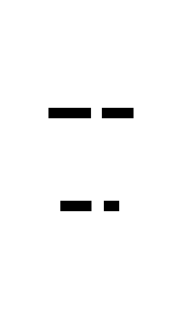

<details>
<summary>View d2 source</summary>

<!-- code-to-uml:source:start -->
```d2
Client -> Kroki: POST source
Kroki -> Renderer: delegate
Renderer -> Kroki: SVG
Kroki -> Client: response
```
<!-- code-to-uml:source:end -->

</details>
<!-- code-to-uml:generated:end -->

## TikZ

<!-- code-to-uml:generated:start -->


<details>
<summary>View tikz source</summary>

<!-- code-to-uml:source:start -->
```tikz
\documentclass{standalone}
\usepackage{tikz}
\begin{document}
\begin{tikzpicture}
  \node[draw, rounded corners] (client) at (0,0) {Client};
  \node[draw, rounded corners] (kroki) at (3,0) {Kroki};
  \draw[->] (client) -- (kroki);
\end{tikzpicture}
\end{document}
```
<!-- code-to-uml:source:end -->

</details>
<!-- code-to-uml:generated:end -->

## DBML

<!-- code-to-uml:generated:start -->
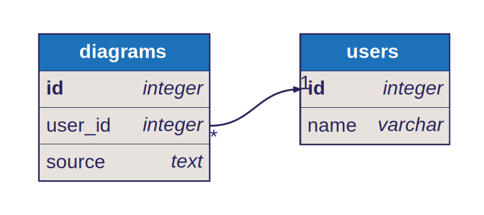

<details>
<summary>View dbml source</summary>

<!-- code-to-uml:source:start -->
```dbml
Table users {
  id integer [primary key]
  name varchar
}

Table diagrams {
  id integer [primary key]
  user_id integer
  source text
}

Ref: diagrams.user_id > users.id
```
<!-- code-to-uml:source:end -->

</details>
<!-- code-to-uml:generated:end -->

## WireViz

<!-- code-to-uml:generated:start -->
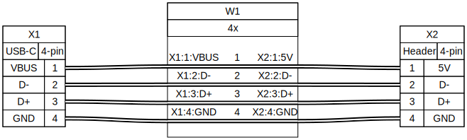

<details>
<summary>View wireviz source</summary>

<!-- code-to-uml:source:start -->
```wireviz
connectors:
  X1:
    type: USB-C
    pinlabels: [VBUS, D-, D+, GND]
  X2:
    type: Header
    pinlabels: [5V, D-, D+, GND]
cables:
  W1:
    wirecount: 4
connections:
  -
    - X1: [1, 2, 3, 4]
    - W1: [1, 2, 3, 4]
    - X2: [1, 2, 3, 4]
```
<!-- code-to-uml:source:end -->

</details>
<!-- code-to-uml:generated:end -->

## GoAT

<!-- code-to-uml:generated:start -->
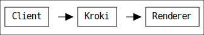

<details>
<summary>View goat source</summary>

<!-- code-to-uml:source:start -->
```goat
+--------+     +-------+     +----------+
| Client | --> | Kroki | --> | Renderer |
+--------+     +-------+     +----------+
```
<!-- code-to-uml:source:end -->

</details>
<!-- code-to-uml:generated:end -->
